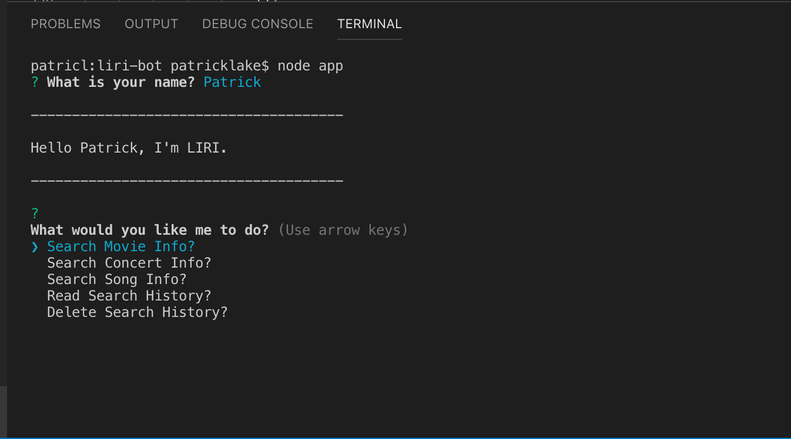
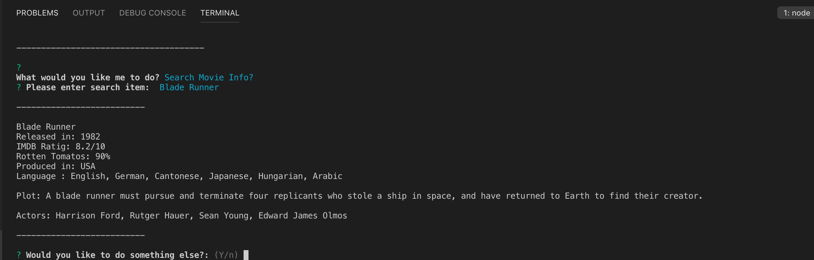
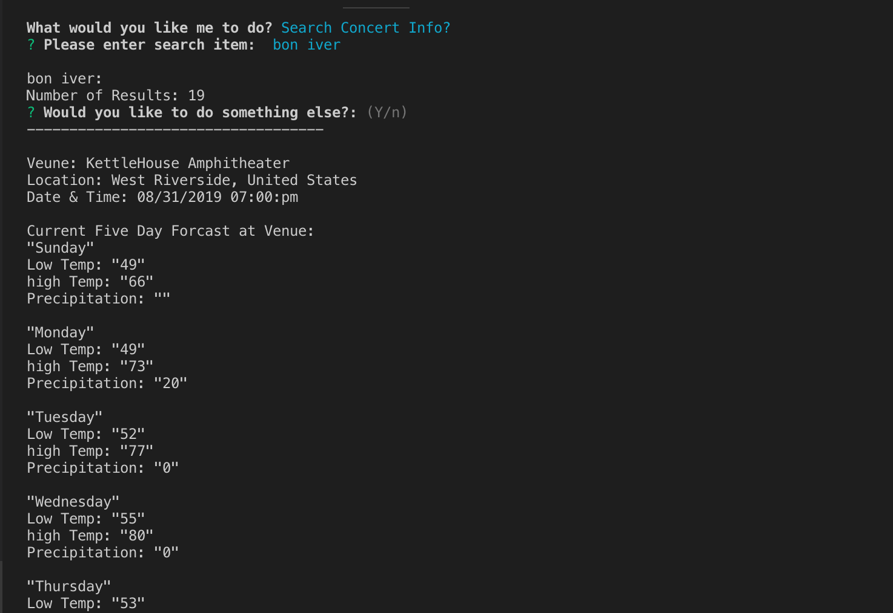
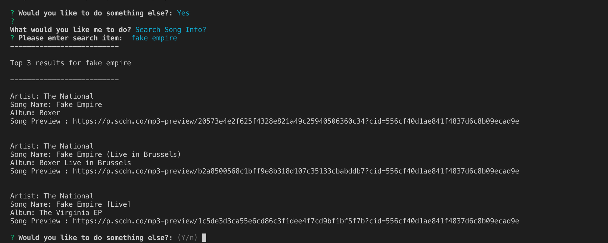
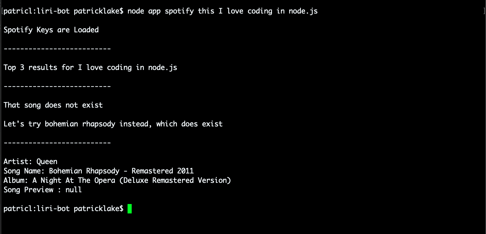
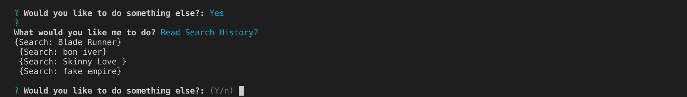
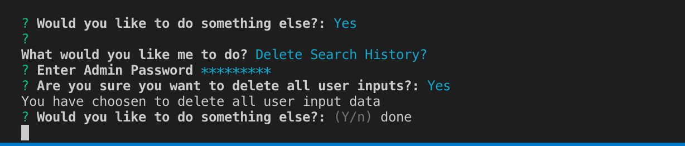

# **LIRI Node.js Application** 

LIRI is a Language Interpretaion and Recognition Interface that runs exculsivly on the terminal through the use of node.js.
 
LIRI responds to very simple and user friendly requests and displays clear and concise data. 
 
Once the application is entered, the user can remain inside the 
With LIRI, we can perform the following searches:

* Movie Data

* Upcoming Concert info

* Song Info

Additionally, we can read or erase all of our previous search queries 
* *Deleting   requires an administrator password*

>  ##### Please note: Orginally, LIRI used comand line prompts such as, "movie-this", "concert-this", and "spotify-this", but I choose to use Inquirer to create a more simple and enjoyable user experiance through prompts

### Here is a video I've made to show LIRI in use: [DEMO VIDEO]()

 

## How LIRI works: 

LIRI is constructed exclusivly using javaScript and is read through node.js. The code is broken down into multiple functions that each handle individual queries. The code first takes in the users selection and determains which function to call. In this case, its checking to see if the user is accesing OMDB, Bands in Town, or Spotify. Once LIRI has determained which function to run, it takes a user prompted input and uses that to initiate a search for that particular information, such as:  **Bon Iver**, or **The Lion King**. 

 

Additionally, LIRI stores all of the user inputs into a simple txt file which can be read and or deleted.

 

## Further Breakdown 

### **START-UP**

When LIRI is first started, it will ask the user their name and responde with a personalized gretting. Then a search menu will appear which will direct the user further. Here is what this looks like: 

After executing a search, LIRI, will ask the user if they wish to perfomrm any additional tasks. If the user selects "y", the search options will reappear, otherwise LIRI will wish the user a goodbye and exit the app. 

### **OMDB**

Selecting the "search movie info" command, LIRI will call a function that will use *[Axios](https://www.npmjs.com/package/axios)* to initiate an ajax request to *[OMDB's API](https://www.npmjs.com/package/axios)* of movie information. Here's an example of what data LIRI shows the user: 

##### *the user input under "Please enter search item" should be a movie title*

 

### **BANDS IN TOWN**

Selecting the "search concert info" command, LIRI will call a function that once again uses *[Axios](https://www.npmjs.com/package/axios)*, on this occation calling on the *[Bands In Town API](https://www.artists.bandsintown.com/bandsintown-api)* to display information on upcoming concert info on the users selected artist. LIRI also shows us a five day weather forcast at each venue that is returned, courtesy of *[Weather-js](https://www.npmjs.com/package/weather-js).*
Here is an example of the info givin by LIRI:

##### *the user input after "Please enter search item" should be a band or artist*

 

### **SPOTIFY** 

Selecting the "search song info" command, LIRI will call a function that search *[Spotify's](https://www.spotify.com/us/premium/?utm_source=us-en_brand_contextual-desktop_text&utm_medium=paidsearch&utm_campaign=alwayson_ucanz_us_performancemarketing_core_brand+contextual-desktop+text+exact+us-en+google&gclid=Cj0KCQjwp5_qBRDBARIsANxdcimY0cLhyCYo-6-eHkEIips9xssyuHriD7vhaSqawBSSiTNYFR53YE0aAhJ9EALw_wcB&gclsrc=aw.ds)* music database for a specify song, displaying that the top three results for that songs information. Here is an example if the info given by LIRI: 

##### *the user input after "Please enter search item" should be a song title*

If the song selected does not exist, LIRI will choose a song for you: 

 

### FILE ACCESS

If the user wants to access all previous search queries, this can be done by selecting the "read search histoy" option, which uses node.js's built in *[fs](https://nodejs.org/api/fs.html)* command to read the attached .txt file.

If the user wished to clear all previous search's, this can be done by selecting the  *"delete search history"* option, which also uses node.js's *[fs](https://nodejs.org/api/fs.html)* command to clear all data in the .txt file. This prompt will require an administrator password and if entered will verify before deleting in order to avoid an unwatnted deletion. Here the user can press *"y"* to continue, or *"n"* to back out. 

*[inquirer](https://www.npmjs.com/package/inquirer)*

