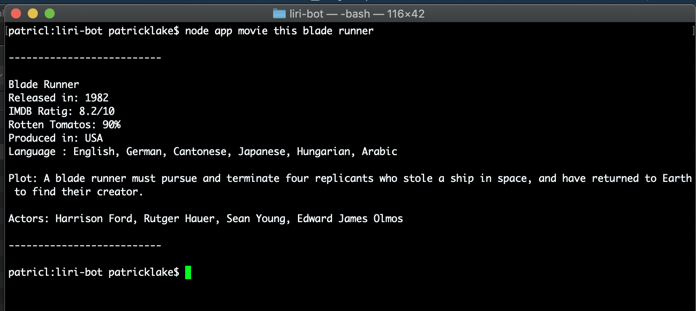
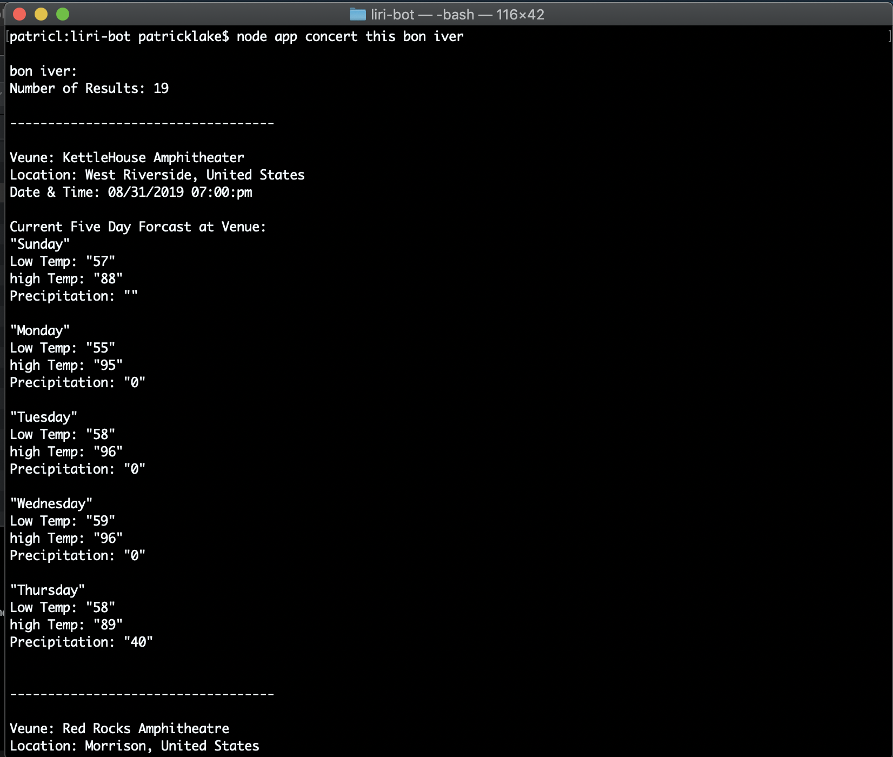
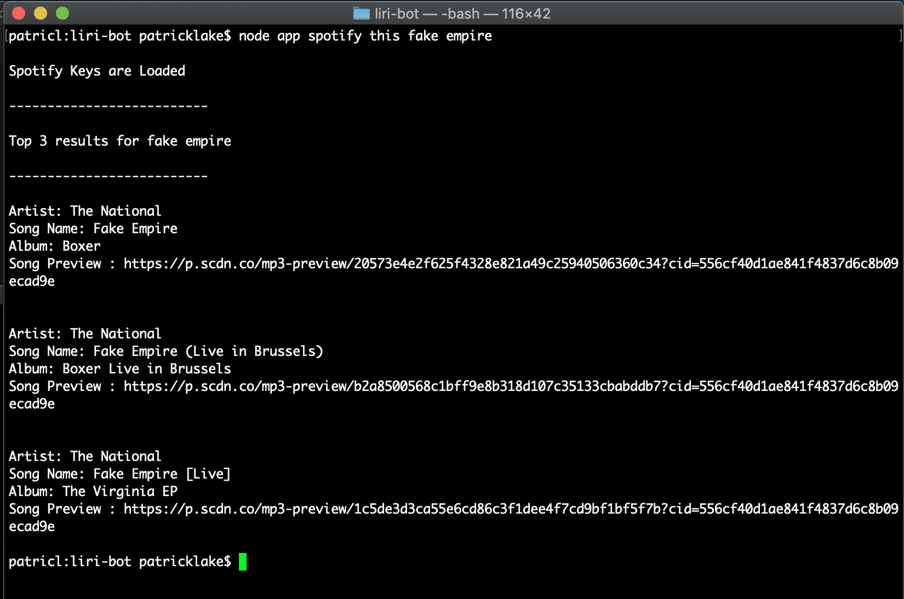

# **LIRI Node.js Application** 

LIRI is a Language Interpretaion and Recognition Interface that runs exculsivly on the terminal through the use of node.js.
 
LIRI responds to very simople user friendly requests and displays clear and consise data. 
 
We can make the following requests using LIRI:

* *node app movie this -----insert movie title here-------*

* *node app concert this -----insert artist / band name here-------*

* *node app spotify this -----insert song name here-------*

Additionally, we can read or erase all of our previous search queries with the following commands: 

* *node app read file*

* *node app delete file* (not to worrie, this command brings up a confirmation prompt via *inquirer*)

>  ##### Please note: *"movie-this", "concert-this", and "spotify-this"* will not work. The "-" is not needed and will produce and error 

 

## How LIRI works: 

LIRI is constructed exculsing using javaScript. The code is broken down into multiple functions that each handle individual queries. The code first takes in the users input and determains which function to call. In this case (get it, case, as in a switch statement...), its checking to see if the user is accesing OMDB with *"movie this"*, Bands in Town with *"concert this"*, or Spotify with *"spotify this"*. Once LIRI has determained which function to run, it takes the second argument and uses that to initiate a search for that particular information, such as: *"concert this **Bon Iver**"*, or *"movie this **The Lion King**"*. 

Additionally, LIRI stores all of the user inputs into a simple txt file which can be read or deleted.

 

### Further Breakdown 

#### MOVIE THIS

Using the *"movie this"* command, LIRI will call a function that will use *[Axios](https://www.npmjs.com/package/axios)* to initiate an ajax request to *[OMDB's API](https://www.npmjs.com/package/axios)* of movie information. Here's an example of what data LIRI shows the user: 

##### *the user input should be a movie title*

 

#### CONCERT THIS

Using the *"concert this"* command, LIRI will call a function that once again uses *[Axios](https://www.npmjs.com/package/axios)*, on this occation calling on the *[Bands In Town API](https://www.artists.bandsintown.com/bandsintown-api)* to display information on upcoming concert info on the users selected artist. LIRI also shows us a five day weather forcast at each venue that is returned, courtesy of *[Weather-js](https://www.npmjs.com/package/weather-js).*
Here is an example of the info givin by LIRI:

##### *the user input should be a band or artist*

 

#### SPOTIFY 

Using the *"spotify this"* command, LIRI will call a function that search *[Spotify's](https://www.spotify.com/us/premium/?utm_source=us-en_brand_contextual-desktop_text&utm_medium=paidsearch&utm_campaign=alwayson_ucanz_us_performancemarketing_core_brand+contextual-desktop+text+exact+us-en+google&gclid=Cj0KCQjwp5_qBRDBARIsANxdcimY0cLhyCYo-6-eHkEIips9xssyuHriD7vhaSqawBSSiTNYFR53YE0aAhJ9EALw_wcB&gclsrc=aw.ds)* music database for a specify song, displaying that songs information. Here is an example if the info given by LIRI: 

##### *the user input should be a song title*

If the song selected does not exist, LIRI will choose a song for you: 

